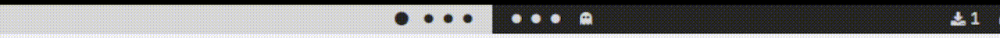

### polybar pacman animation   



# how to use   
---
clone the repo and put it where you want it   
put the following into your polybar's config.ini
```
[module/pacman]
type = custom/script
tail=true
exec = /path/to/polybar-animations/pacman/start.sh      ; change path!
interval = 0.25
label = %output%

[module/monster]
type = custom/script
tail=true
exec = /path/to/polybar-animations/monster/start.sh      ; change path!
interval = 0.15
label = %output%

```
add the modules "pacman" and "monster" to you bars    

if you want to see how and where it goes look at my [dotfiles](https://github.com/itsoctotv/dotfiles/blob/main/polybar/config.ini)    

